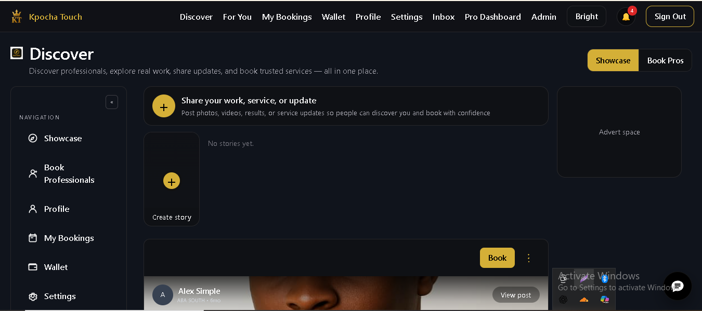

# Kpocha Touch

Production-ready Nigerian marketplace and social platform for service professionals and clients.

## Real-world usage example

Yesterday, I onboarded a friend to test Kpocha Touch.

### Onboarding
He signed in with Google and accessed the platform.

### Booking flow
- He discovered a professional from a post
- He placed a booking directly
- The system assigned it to the selected professional (not random matching)
- The professional accepted the request

### Communication
- A dedicated chat session automatically opened
- They completed the job inside the booking context
- A review was submitted after completion

### Cancellation test
- A second booking was created
- It was cancelled before acceptance
- Funds were automatically returned to wallet

His response after both tests:
"This app is big."

## Live deployment

- Production site: [https://kpochatouch.com](https://kpochatouch.com)

### Live screenshot

## Table of Contents

- [Overview](#overview)
- [Features](#features)
- [Repository structure](#repository-structure)
- [Getting Started](#getting-started)
- [Configuration](#configuration)
- [Scripts](#scripts)
- [Documentation](#documentation)
- [License](#license)

## Overview

This monorepo contains the frontend app, backend API, and background worker for Kpocha Touch.

- `apps/web` — React + Vite single-page app with Capacitor support
- `apps/api` — Express API server with Firebase Admin, Socket.IO, MongoDB, and BullMQ
- `apps/worker` — BullMQ worker for media processing and async jobs
- `docs` — user and legal documentation

## Features

- Service professional discovery and booking
- Wallet-backed payments and escrow flow
- Real-time chat with attachments and reactions
- Audio/video calls with WebRTC signaling, TURN relay support, and native Android incoming call handling
- Media uploads and background processing
- Support tools, notifications, and admin workflows

## Repository structure

/apps/web # frontend application
/apps/api # backend Express API
/apps/worker # background worker service
/docs # in-app documentation and legal docs
/scripts # repo helper scripts
package.json # workspace config and shared scripts

## Route overview

### Backend API routes

The backend mounts its main routers under `/api` in `apps/api/server.js`.

- `/api/bookings`
- `/api/wallet`
- `/api/pin`
- `/api/profile`
- `/api/posts`
- `/api/follow`
- `/api/reviews`
- `/api/comments`
- `/api/payments`
- `/api/post-stats`
- `/api/uploads`
- `/api/payout`
- `/api/risk`
- `/api/aws-liveness`
- `/api/face`
- `/api/notifications`
- `/api/activity`
- `/api/chat`
- `/api/call`
- `/api/webrtc`
- `/api/push`
- `/api/media`
- `/api/adverts`
- `/api/support`
- `/api/admin-support`
- `/api/contact`
- `/api/admin-pros` (optional/admin routes)
- `/api/geo` (optional geo routes)
- `/api/availability` (optional availability routes)
- `/api/settings` (public settings)

### Frontend app routes

The frontend SPA route definitions are in `apps/web/src/App.jsx`.

Public and unauthenticated UI routes:

- `/`
- `/browse`
- `/post/:id`
- `/home`
- `/login`
- `/signup`
- `/docs/*`
- `/legal`
- `/legal/*`
- `/profile/:username`
- `/apply/thanks`
- `/contact`
- `/find`
- `/book/:barberId`

Authenticated and role-based routes:

- `/compose`
- `/stories/create`
- `/bookings/:id`
- `/bookings/:bookingId/chat`
- `/review/:proId`
- `/review-client/:clientUid`
- `/profile`
- `/wallet`
- `/pro/client-wallet`
- `/my-bookings`
- `/settings`
- `/become`
- `/aws-liveness`
- `/client/register`
- `/register` (redirect to `/client/register`)
- `/deactivate`
- `/chat`
- `/inbox`
- `/pro-dashboard`
- `/admin`
- `/admin/support`
- `/admin/decline/:id`
- `/risk-logs`
- `/adverts/new`
- `/my-adverts`
- `/adverts/:id/edit`
- `/admin/adverts`
- `/notifications`

## Getting Started

### Prerequisites

- Node.js 22.x
- npm
- MongoDB
- Redis
- Firebase service account

### Install dependencies

npm install

### Configure environment files

Copy the example env files into each app and update values for your environment.

cp apps/web/.env.example apps/web/.env
cp apps/api/.env.example apps/api/.env

The frontend uses `apps/web/.env`; the backend uses `apps/api/.env`.
The worker uses the same backend environment values (MongoDB, Redis, credentials).

### Run locally

Use separate terminals for each service:

npm run dev:api
npm run dev:web
npm --workspace apps/worker start

## Configuration

Refer to these canonical env example files:

- `apps/web/.env.example`
- `apps/api/.env.example`

Do not commit secrets to the repo.

### Native mobile modules

The frontend includes native mobile support (Capacitor). Native projects are located under `apps/web/android` and `apps/web/ios` and contain platform-specific Activities, Services, and plugins used by the web UI when running inside a native wrapper. Example native components found in the Android module include:

- `IncomingCallActivity`, `CallForegroundService`, `CallNotification` — native call handling and foreground services
- `NativeVideoPlayerActivity`, `NativeVideoPlayerPlugin`, `VideoTrimActivity` — native video playback and trimming
- `StoryViewerActivity`, `StoryComposeActivity` — native story UI flows and composition
- `NativeFeedActivity`, `NativeCommentsActivity`, `NativeFeedPlugin` — native feed and comment integrations

The web app uses runtime checks (e.g., `Capacitor.isNativePlatform()`) and Capacitor listeners to enable native-only behavior (deep links, FCM registration, native push handling). If you build native packages, follow platform build guides under `apps/web/android` and `apps/web/ios`.

### Frontend env highlights (non-sensitive)

The frontend `apps/web/.env` uses Vite variables. Key entries in `apps/web/.env.example` include:

- `VITE_API_BASE_URL` — backend root URL
- `VITE_SOCKET_URL` — socket server URL
- `VITE_PAYSTACK_PUBLIC_KEY` — Paystack public key (non-secret)
- `VITE_FIREBASE_*` — Firebase public config values used by the client SDK
- `VITE_AWS_REGION` / `VITE_AWS_COGNITO_IDENTITY_POOL_ID` — optional AWS liveness config
- `VITE_VAPID_PUBLIC_KEY` — optional web push VAPID public key

Keep secrets (server-side API keys, DB URIs, Paystack secret keys, Firebase service account) in `apps/api/.env` or secure vaults; do not expose them in frontend files.

### Backend env highlights (sensitive)

The backend `apps/api/.env` is copied from `apps/api/.env.example` and contains server-side credentials and runtime configuration.
Key values in `apps/api/.env.example` include:

- `MONGODB_URI` — MongoDB connection string
- `REDIS_URL` — Redis connection string for BullMQ and session caching
- `PORT` — API server port
- `BASE_URL`, `FRONTEND_ORIGIN`, `CORS_ORIGIN` — app URLs and CORS policy
- `PAYSTACK_PUBLIC_KEY`, `PAYSTACK_SECRET_KEY` — payment gateway credentials
- `OPENAI_API_KEY`, `CHATBASE_API_KEY`, `CHATBASE_AGENT_ID` — AI/chat integrations
- `R2_ACCESS_KEY`, `R2_SECRET_KEY`, `R2_BUCKET`, `R2_ENDPOINT`, `R2_PUBLIC_BASE_URL` — Cloudflare R2 media storage
- `SERVICE_KEY_PATH=serviceAccountKey.json` — Firebase service account reference
- `VAPID_PRIVATE_KEY`, `VAPID_PUBLIC_KEY`, `VAPID_SUBJECT` — web push keys
- `ICE_STUN_URLS`, `ICE_TURN_URLS`, `ICE_TURN_USERNAME`, `ICE_TURN_PASSWORD` — WebRTC ICE server settings
- `AWS_ACCESS_KEY_ID`, `AWS_SECRET_ACCESS_KEY`, `AWS_COGNITO_IDENTITY_POOL_ID`, `AWS_REGION` — optional AWS/liveness config

Do not commit `apps/api/.env` or any secret values to version control.

## Scripts

From the repo root:

- `npm run dev:web` — start the web app in development
- `npm run dev:api` — start the backend API in development
- `npm run build:web` — build the frontend for production
- `npm run start:api` — start the backend API in production

Start the worker with:

npm --workspace apps/worker start

## Documentation

- `docs/` — user and legal documentation
- In-app docs are available under `/docs` and `/legal`
- `docs/webrtc.md` — call architecture, signaling flow, TURN/ICE troubleshooting, and native Android call UI behavior

## License

Proprietary. See project owners for licensing and distribution.

- Monitors job queues and processes: media transcoding, call ring timeouts, notifications

## Architecture Overview

### Web App (`apps/web`)

- **React 18** + **Vite** SPA
- **React Router** for navigation
- **Socket.IO client** for real-time events
- **Firebase SDK** for authentication
- **Capacitor** for iOS/Android hybrid builds
- **TailwindCSS** for styling
- **Axios** for API calls
- **FFmpeg.wasm** for local video processing
- **HLS.js** for video streaming

**Key pages & features:**

- Auth flows (register, login, onboarding)
- Client/professional profiles with media
- Service browsing and booking
- Wallet & payment management
- Real-time chat with message threading
- Direct voice/video calls
- Social feed (posts, stories, comments)
- Professional dashboard (bookings, availability, earnings)
- Support chat with AI assistant

### API Server (`apps/api`)

- **Express.js** with CORS middleware
- **Firebase Admin** for token verification and authorization
- **Socket.IO server** for real-time events (chat, notifications, call signaling)
- **BullMQ** for background job queues
- **Mongoose** for MongoDB schema management

**Route modules:**

- `/api/auth/*` — login, logout, token refresh
- `/api/bookings/*` — booking CRUD, status, cancellation
- `/api/chat/*` — messaging, threads, room management
- `/api/call/*` — WebRTC signaling, call records
- `/api/wallets/*` — balance, transactions, payouts, escrow
- `/api/profiles/*` — client/professional profiles, verification
- `/api/media/*` — upload initialization, completion, signed URLs
- `/api/posts/*` — social feed, stories, comments, engagement
- `/api/payments/*` — Paystack webhook handling
- `/api/support/*` — support sessions, AI chat escalation
- `/api/admin/*` — admin dashboard (settings, users, reports)
- Admin routes (`/api/adminPros/*`, `/api/adminSupport/*`) for platform management

### Background Worker (`apps/worker`)

- **BullMQ** job consumer with Redis backend
- Handles media processing queue (`media-processing`), call ring queue (`call-ring-queue`), notifications

**Current job types:**

- `media-processing` — video transcoding with FFmpeg, generates HLS streams
- `call-ring-timeout` — marks rings as expired, sends notifications
- Push notification delivery (web, mobile via Firebase Cloud Messaging)
- Scheduled cron tasks (wallet auto-releases, no-show sweeps, reminder notifications)

## Data Model Highlights

### Key Collections (MongoDB)

- **Profiles** — client and professional identities with verification status
- **Professionals** — professional service listings, ratings, availability
- **Bookings** — booking records with status, payment, scheduling
- **Wallets** — user account balances, transactions, escrow holds
- **ChatMessages** — messages with attachments, reactions, read receipts
- **Posts/Stories** — social content with engagement tracking
- **MediaAssets** — uploaded photos/videos/voice with R2 URLs and transcoding status
- **PaymentSessions** — Paystack payment state and webhook logs
- **CallRecords** — call history with duration, participants, status

### Authentication & Authorization

- **Firebase UID** as primary user identifier
- **JWT tokens** for API requests
- **Role-based access** (client, professional, admin)
- **Verification tiers** (unverified, identity-verified, liveness-verified)

## Deployment Checklist

- [ ] MongoDB connection string (Atlas or self-hosted)
- [ ] Redis instance (ElastiCache, Upstash, or self-hosted)
- [ ] Firebase service account + environment detection
- [ ] AWS IAM credentials (S3 + Rekognition)
- [ ] Cloudflare R2 bucket + API tokens
- [ ] Paystack live keys (not test)
- [ ] OpenAI API key active with sufficient quota
- [ ] Chatbase agent and API key (if using fallback)
- [ ] CORS_ORIGIN set to production frontend URL
- [ ] APP_BASE_URL set to production API URL
- [ ] Admin email addresses in ADMIN_EMAILS (comma-separated)
- [ ] Monitoring: error tracking (Sentry), logging (CloudWatch, LogRocket)
- [ ] Automated backups for MongoDB
- [ ] SSL/TLS certificates for all domains
- [ ] Rate limiting on API endpoints (consider nginx, cloud gateway)
- [ ] Web push VAPID keys configured
- [ ] Redis persistence enabled for production data safety

## Documentation

### User-Facing Docs

Located in `docs/` and served by the web app under `/docs` and `/legal`:

- `docs/README.md` — documentation hub
- `docs/user-guide.md` — how to use the platform as a client
- `docs/professional-guide.md` — how to onboard and manage services as a professional
- `docs/faq.md` — frequently asked questions
- `docs/privacy-policy.md` — privacy and data policy
- `docs/terms-and-conditions.md` — legal terms and platform policies
- `docs/webrtc.md` — WebRTC call implementation notes

### Developer Notes

- **WebRTC**: See `docs/webrtc.md` for call signaling, peer connection flow, and debugging
- **Media processing**: FFmpeg runs in the worker, outputs HLS streams to R2
- **Payment escrow**: Holdings wallet funds locked 3 days; automated release after dispute window
- **Socket.IO rooms**: Keyed by chat room ID (e.g., `chat:user123:user456`, `booking:123`)
- **Admin settings**: Singleton `Settings` doc in MongoDB controls commission split, payout rules, no-show policies

## License

Proprietary. All rights reserved.
